# Erika Danmaku Subsystem Architecture

[中文](danmaku_architecture.md) | [English](danmaku_architecture.en.md) | [日本語](danmaku_architecture.ja.md)

This document describes the current Erika danmaku subsystem, how it maps to NipaPlay's DFM+ danmaku system, and which boundaries should be replaced or preserved. The core idea is simple: Erika should treat itself as a native host for a NipaPlay-style danmaku system. Inputs remain danmaku files and user configuration; the layout core should preserve DFM+ input/output semantics; the final result is rendered together with the video frame inside Erika's native renderer.

## Current Goal

Danmaku is not an external UI layer or a separate display system. It is part of the playback core: the player provides the current video frame and its media time, the danmaku layout queries only that media time for what should be visible, and the renderer composites video, subtitles, and danmaku in the same render tick.

The target flow is:

```text
Danmaku file / JSON / XML / user config
  -> DanmakuSession / track manager
  -> active DanmakuTimeline
  -> DFM+ layout core
  -> per-media-time positioned danmaku
  -> Erika render plan
  -> Metal / WGPU native danmaku pass
```

DFM+ owns layout and filtering. Erika owns session management, timing, lifecycle, C ABI, font/glyph resources, and native GPU composition. The boundary should not blur: Erika should not reinvent a “DFM-like algorithm”; it should make DFM+ semantics hold inside Erika's core.

## NipaPlay Danmaku Structure

NipaPlay's danmaku system has four layers.

The first layer is input normalization. Danmaku may come from local JSON, local Bilibili XML, manual track selection, or cache. Flutter normalizes them into a list of maps. Each item contains at least time, text, type, color, and self-danmaku flags; user settings include font size, display area, scroll duration, density, max lines, duplicate merge, block words, outline, shadow, and font.

The second layer is DFM+ preparation. `DfmPlusLayoutBridge.configure` calls Rust `dfm_plus_prepare_layout_full` whenever the item list, viewport, font size, or config changes. This stage hands the full track and user settings to DFM+, which performs measurement, filtering, duplicate merge, lane allocation, and collision avoidance, then returns a prepared layout. A prepared layout is not “the current frame”; it is the stable layout result for this track under the current viewport/config.

The third layer is per-frame querying. During playback, only the current playback time is passed to the prepared layout. NipaPlay performs the same logic on the Dart side as Rust's `build_dfm_plus_frame`: binary-search the visible window, then compute x for scrolling items from elapsed time, while fixed items use the centered x/y computed during preparation.

The fourth layer is presentation. NipaPlay currently uses its own Flutter/Texture path to draw positioned danmaku; that is not the DFM+ layout core. Erika replaces that presentation layer: keep DFM+ layout input/output, convert positioned danmaku into Erika glyph atlas / quad instances, and composite them in Metal/WGPU together with video.

## NipaPlay DFM+ I/O Contract

The key NipaPlay DFM+ Rust API lives in `/Users/sakiko/Desktop/NipaPlay-Reload/rust/src/api/dfm_plus.rs`. It exposes a prepare + frame-query contract.

Prepare takes normalized danmaku items plus viewport and user config. Key fields include `time_seconds`, `text`, `type_code`, `color_argb`, `is_me`, and collision-related `paint_width` / `paint_height`. Config includes `width`, `height`, `font_size`, `display_area`, `scroll_duration_seconds`, `allow_stacking`, `merge_danmaku`, `max_quantity`, `max_lines_per_type`, `track_gap_ratio`, `outline_width`, `block_words`.

Prepare returns a prepared layout. It stores viewport, scroll/fixed durations, sorted prepared items, item times, and lane statistics. Prepared items keep text, time, type, color, self flag, font size multiplier, merge count, y position, width, scroll speed, duration, whether the item scrolls, and centered_x for fixed items. This output is the source of truth for later frame queries.

Frame query takes only the prepared layout handle and `current_time_seconds`. It returns positioned items for the current frame, each with `item_index`, `x`, `y`, and `offstage_x`. Text, colors, and other style data are not repeated in the frame item; they are resolved through `item_index` back into the prepared item.

This contract matters because DFM+'s power comes from preparing the full track once, not deciding every item position on every frame. Erika should keep this model, but move the handle store into Erika's internal object lifetime and turn the output into an Erika render plan.

## Current Erika Danmaku Path

Erika already has a native danmaku path in these files:

- `crates/erika/src/danmaku.rs`: public data model, parser, timeline, DFM adapter, frame layout, render plan, text rasterizer, glyph atlas.
- `crates/erika/src/danmaku/dfm.rs`: adapter between Erika and the NipaPlay DFM+ prepare/frame-query contract.
- `crates/erika/src/danmaku/dfm_core/*`: model, retainer, filters, measure, factory, timer, types migrated from NipaPlay DFM+.
- `crates/erika/src/presenter.rs`: connects player media time, generation, viewport, and the danmaku engine.
- `crates/erika/src/core.rs`: `RenderFrameContext` merges video frames, subtitle overlay, and danmaku render plan into one renderer call.
- `crates/erika/src/renderer/metal/*` and `crates/erika/src/renderer/wgpu.rs`: native danmaku passes.
- `crates/erika_capi/include/erika.h` / `crates/erika_capi/src/lib.rs`: C ABI for loading, clearing, enabling, configuring, and blocking danmaku.
- `packages/erika_flutter/lib/src/erika_player.dart` and `packages/erika_flutter/macos/Classes/ErikaFlutterPlugin.swift`: the Flutter wrapper only talks to the Erika C API.

The current data flow is:

```mermaid
flowchart LR
  A["JSON / JSONL / Bilibili XML"] --> B["DanmakuTimeline per track"]
  B --> C["DanmakuSession tracks + offsets + enable state"]
  C --> D["Active DanmakuTimeline"]
  D --> E["DfmLayoutEngine"]
  E --> F["dfm.rs adapter"]
  F --> G["dfm_core retainer + filters"]
  G --> H["DfmPreparedLayout"]
  H --> I["DanmakuFrameLayout(media_time, generation)"]
  I --> J["DanmakuRenderPlan glyph atlas + instances"]
  J --> K["RenderFrameContext"]
  K --> L["Metal / WGPU video + subtitle + danmaku composition"]
```



`dfm_core` is already a migrated version of NipaPlay DFM+ core, not a new algorithm written from scratch. The important boundary is that `DanmakuSession` is Erika's input session layer, while `dfm.rs` is the adapter that maps active timelines and `DanmakuLayoutConfig` into a DFM+ prepare request and back into Erika's `DanmakuFrameLayout`.

## Replacement Boundary

The part that should be replaced “as close as possible to the original DFM+ core” is `crates/erika/src/danmaku/dfm.rs` plus `crates/erika/src/danmaku/dfm_core/*`.

Its input should stay aligned with NipaPlay DFM+: normalized items, viewport, font metrics, and user config. Erika may use its own Rust types, but field semantics should match NipaPlay: time, text, type_code, color, is_me, paint_width/paint_height, display_area, scroll_duration, allow_stacking, merge, max_quantity, max_lines, track_gap, outline, block_words, and so on.

Before DFM+, Erika adds `DanmakuSession`. It does not participate in layout; it only prepares an active timeline that DFM+ can consume. Multiple tracks may be enabled at once, and per-track and global offsets are applied when building the active timeline. After merging, the session allocates unique layout item IDs for that content revision instead of packing host business IDs into layout identity. Consecutive planner windows carry both completed track assignments and rejection decisions forward; timeline/session content, viewport, or layout-config changes rebuild that planning history. Generation only gates current-frame output for the renderer.

The output should also stay close to NipaPlay DFM+: prepared layout stores stable results, and frame query returns only the visible items and their positions for the current media time. Erika can then map `item_index` to text, colors, font size, outline, and so on to build `DanmakuFrameLayout` and `DanmakuRenderPlan`.

In other words, Erika may change the shell and the final drawing path, but not the semantic behavior of the DFM+ core. The C ABI exposed to player/Flutter should cover the NipaPlay-style input surface: danmaku files, JSON/JSONL/XML, display area, font size, scroll duration, density, max lines, duplicate merge, block words, outline/shadow, enable state, and track switching.

## Public API Today

The Rust presenter already exposes the danmaku session surface: load/replace default danmaku, append multiple tracks, remove a track, enable/disable per track, per-track offsets, global offset, clear, enable, and configure danmaku. The older `load_danmaku_file` / `load_danmaku_json` remain as “replace the default track” for compatibility with the old single-track call pattern.

Current C ABI entry points include:

```c
ErikaStatus erika_presenter_load_danmaku_file(ErikaPresenterHandle *handle, const char *uri);
ErikaStatus erika_presenter_load_danmaku_json(ErikaPresenterHandle *handle, const char *json);
ErikaStatus erika_presenter_add_danmaku_track_file(ErikaPresenterHandle *handle, const char *uri, const char *name, int64_t offset_micros, uint64_t *out_track_id);
ErikaStatus erika_presenter_add_danmaku_track_json(ErikaPresenterHandle *handle, const char *json, const char *name, int64_t offset_micros, uint64_t *out_track_id);
ErikaStatus erika_presenter_remove_danmaku_track(ErikaPresenterHandle *handle, uint64_t track_id);
ErikaStatus erika_presenter_set_danmaku_track_enabled(ErikaPresenterHandle *handle, uint64_t track_id, bool enabled);
ErikaStatus erika_presenter_set_danmaku_track_offset(ErikaPresenterHandle *handle, uint64_t track_id, int64_t offset_micros);
ErikaStatus erika_presenter_set_danmaku_global_offset(ErikaPresenterHandle *handle, int64_t offset_micros);
ErikaStatus erika_presenter_danmaku_tracks(ErikaPresenterHandle *handle, ErikaDanmakuTrackInfo *out_tracks, uintptr_t capacity, uintptr_t *out_len);
ErikaStatus erika_presenter_clear_danmaku(ErikaPresenterHandle *handle);
ErikaStatus erika_presenter_set_danmaku_enabled(ErikaPresenterHandle *handle, bool enabled);
ErikaStatus erika_presenter_set_danmaku_config(ErikaPresenterHandle *handle, ErikaDanmakuConfig config);
ErikaStatus erika_presenter_set_danmaku_font(ErikaPresenterHandle *handle, const char *family, const char *file_path);
ErikaStatus erika_presenter_set_danmaku_block_words_json(ErikaPresenterHandle *handle, const char *json);
```

`ErikaDanmakuConfig` currently includes `enabled`, `font_size`, `opacity`, `display_area`, `scroll_duration_seconds`, `scroll_speed_factor`, `track_gap_ratio`, `outline_width`, `shadow_offset`, `shadow_style`, `merge_duplicates`, `allow_stacking`, `allow_scroll_overwrite`, `max_quantity`, `max_lines_per_mode`, `block_top`, `block_bottom`, and `block_scroll`. Font family/file input is passed through `erika_presenter_set_danmaku_font` so temporary string pointers do not have to live inside the config struct.

The Flutter wrapper exposes `addDanmakuTrackFile`, `addDanmakuTrackJson`, `removeDanmakuTrack`, `setDanmakuTrackEnabled`, `setDanmakuTrackOffset`, `setDanmakuGlobalOffset`, `danmakuTracks`, and the older `loadDanmakuFile` / `loadDanmakuJson` / `clearDanmaku` / `setDanmakuConfig`. `setDanmakuConfig` now also carries `customFontFamily`, `customFontFilePath`, and the DFM+ texture-path semantics of `shadowStyle`.

That means the player side can now push NipaPlay-style “danmaku file + user config + track control” into Erika, while the output continues to flow with the video frame into the native view.

The remaining work is to keep aligning remote/cache sources, structured block rules, config persistence, the NipaPlay multi-kernel selection abstraction, and a few behavior switches that are not fully forwarded yet in the DFM+ adapter.

## Timing Contract

Danmaku timing is owned by Erika's playback core, not by a separate danmaku timer.

`PlayerVideoFrame` carries `pts`, `media_time`, and `generation`. After the presenter uploads a frame in `pump_video`, it uses `frame.pts.unwrap_or(frame.media_time)` as the current danmaku query time. `update_overlay` then uses the same PTS to generate subtitle overlay and danmaku render plan. The renderer receives `RenderFrameContext { media_time, generation, overlay, danmaku }`.

The renderer gates out mismatched danmaku plans. Both Metal and WGPU require the plan `generation` to equal the context generation, the plan `media_time` to equal the context media time, and the viewport to match the current output size. That way old plans do not keep rendering after seek, stop, close, danmaku-track switches, or config changes.

This means danmaku position is not just “frozen while paused.” At any moment it is driven by the video media timeline. While playback advances, scrolling danmaku move continuously with media time; during pause, media time stays unchanged so positions stay fixed; after seek, the new media time is queried directly, and the old plan is discarded because the generation no longer matches.

## Fonts, Measurement, and Glyph Atlas

DFM+ collision results depend on text width and height. If measurement and actual drawing use different font metrics, lane allocation will diverge from the final image. For that reason Erika keeps `DanmakuTextRasterizer` inside the layout engine: prepare measures text with the same font set, and render-plan generation uses the same glyph rasterization / atlas data.

Font size semantics are split into two layers. `size` in source files and the third field in Bilibili XML still follow the default Bilibili base of `25`; `ErikaDanmakuConfig.font_size` from the player and Flutter wrapper follows NipaPlay/Flutter logic-size semantics, with desktop defaulting to `30`. Erika embeds and prefers NipaPlay's `Droid Sans Fallback` danmaku font first, and converts only from logical size to glyph-atlas physical pixels using the surface backing scale. Callers do not need to multiply by any extra renderer compensation ratio.

Erika's render plan does not pack the whole danmaku line into a single bitmap. It caches glyphs into a persistent atlas and emits `DanmakuGlyphInstance` records. Each instance contains screen rect, atlas tex rect, fill color, outline color, shadow color, and offset. Metal/WGPU only needs to bind the atlas texture and draw alpha-mask quads.

The current atlas has fill alpha and outline alpha masks so shadow/outline/fill can be drawn in that order. The atlas carries a version, and the renderer uses version, size, and stride to decide whether a GPU texture can be reused, avoiding needless full-ատlas uploads every frame.

## Renderer Composition Point

The danmaku pass sits after video frame upload and before present. The renderer input is not an external window pointer or a separate danmaku render loop; it is the `DanmakuRenderPlan` inside `RenderFrameContext`.

On Metal, `render_video_frame_inner` draws the video texture first, then the subtitle overlay, then the danmaku glyph instances. WGPU folds the danmaku draw into the current video draw flow and uses the same plan generation/media-time gate. Renderer statistics and presenter statistics record `danmaku_passes`, `danmaku_items`, and `danmaku_frames`.

## Current Differences from NipaPlay

Erika already keeps the main DFM+ advantages: prepare/frame-query separation, binary search over the time window, track retainer, scrolling collision avoidance, top/bottom fixed lanes, display area, track gap, density control, max lines, duplicate merge, block words, and the basic regex block structure. It also now has the danmaku session layer, which can normalize multiple tracks, per-track offsets, and a global offset into one active timeline before handing it to DFM+.

It is still not a complete “drop-in NipaPlay danmaku system.” Main differences:

- NipaPlay DFM+ API uses `DfmPlusPreparedLayout.handle` and `DfmPlusFrameRequest.layout_handle`; Erika uses an internal `DfmPreparedLayout` object instead of a global handle store. This is a lifecycle-shell difference and should not affect behavior.
- NipaPlay prepared/frame output keeps `frame item -> item_index -> prepared item` very explicit; Erika currently maps further into `DanmakuPlacedItem` and carries text/style earlier. That works, but Erika must keep the `item_index` / source-ID semantics intact for behavior matching and tests.
- NipaPlay's full settings surface comes from Flutter state, including tracks, offsets, custom font, display settings, and block configuration; Erika C ABI already covers tracks, offset control, custom font family/path, and DFM+ shadowStyle, but remote/cache sources, structured block rules, and config persistence still need to be filled in.
- Erika's renderer output is already native, which is intentional and should not be compared against NipaPlay's final presentation form.
- The current `dfm_core` is migrated, but the adapter still has Erika-specific mapping and config interpretation. Future work should compare against the NipaPlay DFM+ API field-by-field rather than continuing to hand-write “similar-looking” behavior.

## Future Implementation Principles

The future work is to make Erika's compute layer more like NipaPlay DFM+, and Erika's render layer more like Erika itself.

The compute layer should preserve NipaPlay's inputs, outputs, and core behavior. The FRB generator layer, global handle store, and Flutter widget dependencies may be removed, but the DFM+ configuration fields and intermediate state should stay. Erika's adapter should do type conversion, lifecycle management, and renderer-facing projection only.

The API layer should expose the NipaPlay danmaku input surface to the player and Flutter wrapper. The Flutter wrapper should only pass user settings, danmaku files, and track selection to Erika, not perform danmaku layout or drawing itself.

The render layer should stay native to Erika. DFM+ outputs “where each danmaku item is at the current media time, and what style it has,” not GPU textures or Flutter resources. Erika's renderer turns that output into glyph atlases, quad instances, and Metal/WGPU composition together with video.

The synchronization layer must keep the current generation + media_time contract. Seek, stop, close, track switch, and config change all invalidate the old plan; each frame query only looks at the video timeline; danmaku do not own a separate wall-clock timer. That contract is the real fix for “the video jumped but the danmaku didn't.”
