# Erika 弾幕サブシステムアーキテクチャ

[中文](danmaku_architecture.md) | [English](danmaku_architecture.en.md) | [日本語](danmaku_architecture.ja.md)

この文書は、現在の Erika 弾幕サブシステム、その NipaPlay DFM+ 弾幕システムとの対応関係、そして今後置き換えるべき境界と維持すべき境界を記録します。核となる考え方は単純で、Erika 自身を NipaPlay 風の弾幕システムを native に受け持つホストとして扱うことです。入力は弾幕ファイルとユーザー設定のまま、layout core は DFM+ の input/output semantics を保ち、最終結果は Erika の native renderer で動画フレームと一緒に描画されます。

## 現在の目標

弾幕は外部 UI 層でも、別系統の表示システムでもありません。再生コアの一部です。player は現在の video frame と media time を渡し、弾幕 layout はその media time だけを使って表示対象を決め、renderer は video / subtitle / danmaku を同じ render tick で合成します。

目標となる流れは次の通りです。

```text
Danmaku file / JSON / XML / user config
  -> DanmakuSession / track manager
  -> active DanmakuTimeline
  -> DFM+ layout core
  -> per-media-time positioned danmaku
  -> Erika render plan
  -> Metal / WGPU native danmaku pass
```

DFM+ が担うのは layout と filtering、Erika が担うのは session management、timing、lifecycle、C ABI、font/glyph resources、native GPU composition です。この境界は曖昧にしてはいけません。Erika は「DFM っぽい別アルゴリズム」を作るのではなく、Erika core の中で DFM+ semantics を成立させるべきです。

## NipaPlay の弾幕構造

NipaPlay の弾幕システムは 4 層に分かれます。

第 1 層は input normalization です。弾幕は local JSON、local Bilibili XML、手動の track selection、cache から来る場合があり、Flutter 側で list of maps に正規化します。各 item には少なくとも time、text、type、color、self-danmaku flags が含まれ、user settings には font size、display area、scroll duration、density、max lines、duplicate merge、block words、outline、shadow、font が含まれます。

第 2 層は DFM+ preparation です。`DfmPlusLayoutBridge.configure` は item list、viewport、font size、config が変わるたびに Rust の `dfm_plus_prepare_layout_full` を呼びます。この段階で全トラックと user settings を DFM+ に渡し、measurement、filtering、duplicate merge、lane allocation、collision avoidance を実行して prepared layout を返します。prepared layout は「現在の frame」ではなく、現在の viewport/config に対する安定した layout 結果です。

第 3 層は per-frame querying です。再生中は current playback time だけを prepared layout に渡します。NipaPlay の Dart 側には Rust の `build_dfm_plus_frame` と等価な処理があり、表示 window を binary search で取り、scrolling item の x を elapsed から計算し、fixed item は preparation 時に計算した centered x/y を使います。

第 4 層は presentation です。NipaPlay は現在、positioned danmaku を Flutter/Texture path で描画していますが、これは DFM+ layout core ではありません。Erika が置き換えるのはこの層で、DFM+ の input/output は維持したまま、positioned danmaku を Erika の glyph atlas / quad instances に変換して Metal/WGPU で動画と一緒に合成します。

## NipaPlay DFM+ の入出力契約

NipaPlay DFM+ Rust API の中心は `/Users/sakiko/Desktop/NipaPlay-Reload/rust/src/api/dfm_plus.rs` にあります。これは prepare + frame-query の契約を公開しています。

Prepare には正規化済み item、viewport、user config が入ります。重要な field は `time_seconds`、`text`、`type_code`、`color_argb`、`is_me`、collision 用の `paint_width` / `paint_height` です。config には `width`、`height`、`font_size`、`display_area`、`scroll_duration_seconds`、`allow_stacking`、`merge_danmaku`、`max_quantity`、`max_lines_per_type`、`track_gap_ratio`、`outline_width`、`block_words` があります。

Prepare は prepared layout を返します。そこには viewport、scroll/fixed duration、sorted prepared items、item_times、lane statistics が保持されます。prepared item には text、time、type、color、self flag、font size multiplier、merge count、y position、width、scroll speed、duration、scroll item かどうか、fixed item 用の centered_x が入ります。この出力が後続 frame query の source of truth です。

Frame query には prepared layout handle と `current_time_seconds` だけを渡します。返るのは現在 frame の positioned items で、各 item には `item_index`、`x`、`y`、`offstage_x` が含まれます。text や color などの style は frame item に重複して載せず、`item_index` から prepared item を引きます。

この契約が重要なのは、DFM+ の強みが毎 frame 位置を決めることではなく、track 全体を一度 prepare することにあるからです。Erika もこの model を維持しつつ、handle store を Erika 内部の lifetime に移し、出力を Erika render plan に変えるべきです。

## 現在の Erika の弾幕経路

Erika には既に native 弾幕経路があります。

- `crates/erika/src/danmaku.rs`: public data model、parser、timeline、DFM adapter、frame layout、render plan、text rasterizer、glyph atlas。
- `crates/erika/src/danmaku/dfm.rs`: Erika と NipaPlay DFM+ の prepare/frame-query contract をつなぐ adapter。
- `crates/erika/src/danmaku/dfm_core/*`: NipaPlay DFM+ から移植された model、retainer、filters、measure、factory、timer、types。
- `crates/erika/src/presenter.rs`: player の media time、generation、viewport と弾幕 engine を接続。
- `crates/erika/src/core.rs`: `RenderFrameContext` が video frame、subtitle overlay、danmaku render plan を 1 回の renderer call にまとめる。
- `crates/erika/src/renderer/metal/*` と `crates/erika/src/renderer/wgpu.rs`: native danmaku pass。
- `crates/erika_capi/include/erika.h` / `crates/erika_capi/src/lib.rs`: 弾幕の load、clear、enable、config、block の C ABI。
- `packages/erika_flutter/lib/src/erika_player.dart` と `packages/erika_flutter/macos/Classes/ErikaFlutterPlugin.swift`: Flutter wrapper は Erika C API だけを呼ぶ。

現在の data flow は次の通りです。

```mermaid
flowchart LR
  A["JSON / JSONL / Bilibili XML"] --> B["DanmakuTimeline per track"]
  B --> C["DanmakuSession tracks + offsets + enable state"]
  C --> D["Active DanmakuTimeline"]
  D --> E["DfmLayoutEngine"]
  E --> F["dfm.rs adapter"]
  F --> G["dfm_core retainer + filters"]
  G --> H["DfmPreparedLayout"]
  H --> I["DanmakuFrameLayout(media_time, generation)"]
  I --> J["DanmakuRenderPlan glyph atlas + instances"]
  J --> K["RenderFrameContext"]
  K --> L["Metal / WGPU video + subtitle + danmaku composition"]
```



`dfm_core` は NipaPlay DFM+ core を移植したもので、ゼロから書いた別アルゴリズムではありません。重要なのは、`DanmakuSession` が Erika の input session layer であり、`dfm.rs` が active timeline と `DanmakuLayoutConfig` を DFM+ の prepare request に変換し、さらに `DanmakuFrameLayout` に戻す adapter だという点です。

## 置き換え境界

できるだけ「元の DFM+ core をそのまま受け持つ」べき部分は、`crates/erika/src/danmaku/dfm.rs` と `crates/erika/src/danmaku/dfm_core/*` です。

入力は NipaPlay DFM+ の抽象とそろえるべきです。つまり、正規化済み item、viewport、font metrics、user config です。Erika は独自の Rust 型を使っても構いませんが、field semantics は NipaPlay と一致していなければなりません。time、text、type_code、color、is_me、paint_width/paint_height、display_area、scroll_duration、allow_stacking、merge、max_quantity、max_lines、track_gap、outline、block_words などが DFM+ prepare に流れ込む必要があります。

DFM+ の前段にある `DanmakuSession` は layout algorithm には参加しません。複数 track を同時に有効化でき、track ごとの offset と global offset は active timeline 構築時に適用されます。merge 後は host の business id を layout identity に pack せず、session がその content revision 専用の一意な layout item id を割り当てます。連続する planner window は確定済みの track assignment と reject decision の両方を引き継ぎ、timeline/session content、viewport、layout config が変わったときだけ planning history を作り直します。generation は renderer の current-frame gate にだけ使います。

出力側も NipaPlay DFM+ の抽象に近いままであるべきです。prepared layout は安定した結果を保持し、frame query は current media time に対する visible items と位置だけを返します。その後で Erika が `item_index` に対応する text、color、font size、outline などを `DanmakuFrameLayout` と `DanmakuRenderPlan` に変換します。

要するに、Erika が変えてよいのは外側の shell と最終描画方法であり、DFM+ core の semantic behavior ではありません。player/Flutter に公開する C ABI も、NipaPlay 的な入力面をカバーすべきです。danmaku file、JSON/JSONL/XML、display area、font size、scroll duration、density、max lines、duplicate merge、block words、outline/shadow、enable state、track switching などです。

## 公開 API

Rust presenter はすでに弾幕 session の入力面を持っています。default danmaku の load/replace、複数 track の append、track の remove、track ごとの enable/disable、track offset、global offset、clear、enable、config が可能です。旧 `load_danmaku_file` / `load_danmaku_json` は single-track 互換用に「default track を置き換える」意味で残されています。

現在の C ABI entry point は次の通りです。

```c
ErikaStatus erika_presenter_load_danmaku_file(ErikaPresenterHandle *handle, const char *uri);
ErikaStatus erika_presenter_load_danmaku_json(ErikaPresenterHandle *handle, const char *json);
ErikaStatus erika_presenter_add_danmaku_track_file(ErikaPresenterHandle *handle, const char *uri, const char *name, int64_t offset_micros, uint64_t *out_track_id);
ErikaStatus erika_presenter_add_danmaku_track_json(ErikaPresenterHandle *handle, const char *json, const char *name, int64_t offset_micros, uint64_t *out_track_id);
ErikaStatus erika_presenter_remove_danmaku_track(ErikaPresenterHandle *handle, uint64_t track_id);
ErikaStatus erika_presenter_set_danmaku_track_enabled(ErikaPresenterHandle *handle, uint64_t track_id, bool enabled);
ErikaStatus erika_presenter_set_danmaku_track_offset(ErikaPresenterHandle *handle, uint64_t track_id, int64_t offset_micros);
ErikaStatus erika_presenter_set_danmaku_global_offset(ErikaPresenterHandle *handle, int64_t offset_micros);
ErikaStatus erika_presenter_danmaku_tracks(ErikaPresenterHandle *handle, ErikaDanmakuTrackInfo *out_tracks, uintptr_t capacity, uintptr_t *out_len);
ErikaStatus erika_presenter_clear_danmaku(ErikaPresenterHandle *handle);
ErikaStatus erika_presenter_set_danmaku_enabled(ErikaPresenterHandle *handle, bool enabled);
ErikaStatus erika_presenter_set_danmaku_config(ErikaPresenterHandle *handle, ErikaDanmakuConfig config);
ErikaStatus erika_presenter_set_danmaku_font(ErikaPresenterHandle *handle, const char *family, const char *file_path);
ErikaStatus erika_presenter_set_danmaku_block_words_json(ErikaPresenterHandle *handle, const char *json);
```

`ErikaDanmakuConfig` には `enabled`、`font_size`、`opacity`、`display_area`、`scroll_duration_seconds`、`scroll_speed_factor`、`track_gap_ratio`、`outline_width`、`shadow_offset`、`shadow_style`、`merge_duplicates`、`allow_stacking`、`allow_scroll_overwrite`、`max_quantity`、`max_lines_per_mode`、`block_top`、`block_bottom`、`block_scroll` が含まれます。font family / file input は `erika_presenter_set_danmaku_font` で渡すため、config struct に一時文字列ポインタを入れる必要がありません。

Flutter wrapper は `addDanmakuTrackFile`、`addDanmakuTrackJson`、`removeDanmakuTrack`、`setDanmakuTrackEnabled`、`setDanmakuTrackOffset`、`setDanmakuGlobalOffset`、`danmakuTracks`、および旧 `loadDanmakuFile` / `loadDanmakuJson` / `clearDanmaku` / `setDanmakuConfig` を公開しています。`setDanmakuConfig` は `customFontFamily`、`customFontFilePath`、DFM+ texture path 的な `shadowStyle` も受け取れます。

つまり、player 側は NipaPlay 風の「弾幕ファイル + ユーザー設定 + track control」を Erika に渡せるようになっており、出力はそのまま video frame と一緒に native view に流れます。

残りの作業は、remote/cache source、structured block rules、config persistence、NipaPlay multi-kernel selection 抽象、そして DFM+ adapter にまだ完全に転送されていない挙動スイッチを埋めていくことです。

## 時間同期契約

弾幕の時間同期は、独立した弾幕タイマーではなく Erika の再生コアが担当します。

`PlayerVideoFrame` は `pts`、`media_time`、`generation` を持ちます。presenter が `pump_video` で frame を upload した後、`frame.pts.unwrap_or(frame.media_time)` を現在の弾幕 query time として使います。その後 `update_overlay` が同じ PTS を使って subtitle overlay と danmaku render plan を生成します。最終的に renderer は `RenderFrameContext { media_time, generation, overlay, danmaku }` を受け取ります。

renderer は不一致の danmaku plan を gate で落とします。Metal / WGPU ともに plan の `generation` が context generation と一致し、viewport が現在の出力サイズに一致する必要があります。media_time の照合は presenter の windowed plan が担います——各 plan は `[window_start, window_end]` を持ち、再生時間が window を外れると古い plan は描画に回りません。これにより seek、stop、close、track switch、config change の後に古い generation / 古い window の plan が描画され続けることを防ぎます。

つまり、弾幕位置は「pause 中に止まる」だけではありません。常に video media timeline によって決まります。再生中は media time に合わせて scrolling 弾幕が流れ、pause 中は media time が変わらないので位置も変わらず、seek 後は新しい media time を直接 query し、古い plan は generation 不一致で破棄されます。

## フォント、測定、glyph atlas

DFM+ の collision 結果は text width と height に依存します。measurement と実描画で違う font metrics を使うと、lane allocation が最終画像とずれてしまいます。そのため Erika は `DanmakuTextRasterizer` を layout engine の内部に置き、prepare 時に同じ font set で測定し、render plan 生成でも同じ glyph rasterization / atlas data を使います。

font size semantics は 2 層に分かれます。source file の `size` / Bilibili XML の 3 番目の field は引き続き Bilibili 既定の `25` を基準にし、player と Flutter wrapper から渡される `ErikaDanmakuConfig.font_size` は NipaPlay / Flutter の logic-size semantics に従います。desktop の既定は `30` です。Erika は NipaPlay の `Droid Sans Fallback` 弾幕フォントを優先的に埋め込み、surface backing scale を使って logical size から glyph atlas の physical pixel へ変換します。呼び出し側が renderer 補正比率をさらに掛ける必要はありません。

Erika の render plan は弾幕全体を 1 枚の bitmap にしません。glyph を persistent atlas にキャッシュし、`DanmakuGlyphInstance` を出力します。各 instance には screen rect、atlas tex rect、fill color、outline color、shadow color、offset が含まれます。Metal / WGPU は atlas texture を bind して alpha mask quad を描くだけです。

現在の atlas には fill alpha と outline alpha の 2 つの mask があり、shadow → outline → fill の順で描画します。atlas には version があり、renderer は version / size / stride を見て GPU texture を再利用できるか判断し、毎 frame の無意味な全面再送を避けます。

## Renderer 合成位置

弾幕 pass は video frame upload の後、present の前に入ります。renderer の input は外部 window pointer や別の弾幕 render loop ではなく、`RenderFrameContext` の中にある `DanmakuRenderPlan` です。

Metal 側では `render_video_frame_inner` が video texture を先に描き、その後 subtitle overlay、最後に danmaku glyph instances を描画します。WGPU 側も同じ video draw flow に danmaku draw を組み込み、同じ plan generation/media-time gate を使います。renderer stats と presenter stats は `danmaku_passes`、`danmaku_items`、`danmaku_frames` を記録します。

## NipaPlay との現在の差分

Erika はすでに DFM+ の重要な利点を保持しています。prepare/frame-query 分離、time window の binary search、track retainer、scrolling collision avoidance、top/bottom fixed lanes、display area、track gap、density control、max lines、duplicate merge、block words、基本的な regex block 構造です。さらに、複数 track、track ごとの offset、global offset を 1 つの active timeline にまとめる danmaku session layer も備えています。

ただし、まだ完全な「NipaPlay 弾幕システムそのもの」ではありません。主な差分は次の通りです。

- NipaPlay DFM+ API は `DfmPlusPreparedLayout.handle` と `DfmPlusFrameRequest.layout_handle` を使いますが、Erika は global handle store ではなく内部の `DfmPreparedLayout` object を使います。これは lifecycle shell の違いで、挙動に影響すべきではありません。
- NipaPlay の prepared/frame output は `frame item -> item_index -> prepared item` の関係が明確ですが、Erika はさらに `DanmakuPlacedItem` にマッピングし、text/style を早めに持ちます。これは動作しますが、behavior matching と test のために item_index / source id semantics を保つ必要があります。
- NipaPlay の完全な設定面は Flutter state 由来で、track、offset、custom font、display settings、block configuration を含みます。Erika C ABI はすでに track、offset control、custom font family/path、DFM+ shadowStyle をカバーしていますが、remote/cache source、structured block rules、config persistence はまだ詰める必要があります。
- Erika の renderer output はすでに native であり、これは意図した差分です。NipaPlay の最終的な presentation 形態と比べるべきではありません。
- 現在の `dfm_core` は移植済みですが、adapter にはまだ Erika 固有の mapping と config interpretation があります。今後は「似た挙動」を手で増やすのではなく、NipaPlay DFM+ API と field 単位で照合していくべきです。

## 今後の実装方針

今後やるべきことは、Erika の compute layer をより NipaPlay DFM+ に近づけ、renderer layer をより Erika らしくすることです。

compute layer は NipaPlay の input、output、core behavior を保つべきです。FRB 生成層、global handle store、Flutter widget 依存は削除しても構いませんが、DFM+ に必要な configuration fields と中間状態は残すべきです。Erika の adapter は type conversion、lifecycle management、renderer-facing projection だけを担当します。

API layer は NipaPlay の弾幕 input surface を player と Flutter wrapper に公開すべきです。Flutter wrapper は user settings、弾幕ファイル、track selection を Erika に渡すだけで、自前で弾幕 layout や描画を行うべきではありません。

render layer は Erika の native 実装として保つべきです。DFM+ が出力するのは「current media time で各弾幕がどこにあり、どんな style か」であって、GPU texture や Flutter resource ではありません。Erika renderer はその出力を glyph atlas、quad instances、Metal/WGPU 合成に変え、動画と一緒に描画します。

synchronization layer は現在の generation + media_time 契約を維持しなければなりません。seek、stop、close、track switch、config change はすべて古い plan を無効化し、各 frame query は video timeline だけを見ます。弾幕は別の wall-clock timer を持ちません。この契約こそが「動画は跳んだのに弾幕が跳ばない」を解決する本体です。
